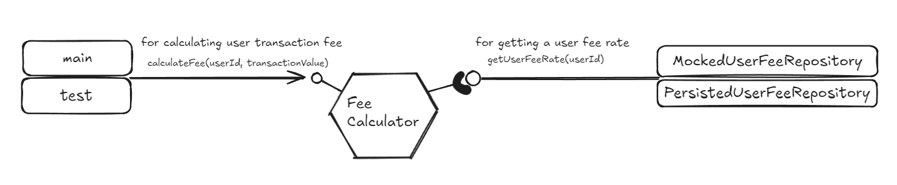

# Hexagonal Architecture POC

A Fee Calculator Service with simplified business logic and entities made with the purpose of analyzing and testing the Hexagonal Architecture (Ports and Adapters) from Alistair Cockburn.

